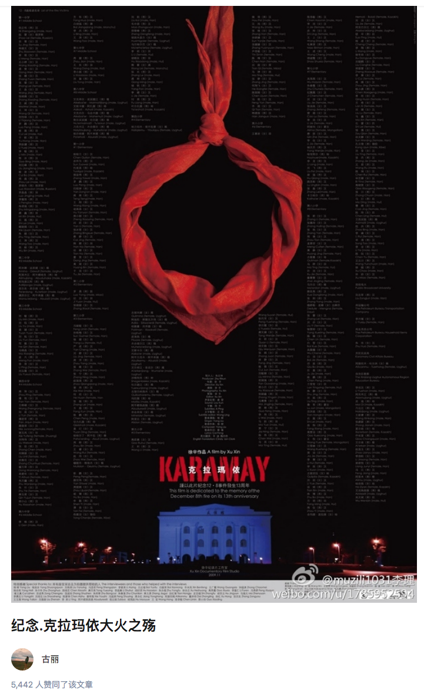

https://zhuanlan.zhihu.com/p/24240815

纪念.克拉玛依大火之殇
==================

古丽

5,442 人赞同了该文章

今天晚上刷朋友圈时，一个克拉玛依的小伙伴发的消息引起了我的注意。
随手看了看时间，过了12点就是2016年12月8日了。

时间过得真快。

那一年，是1994年，那一天的今天，是一个寒冬。

对于远在西北边陲的克拉玛依，今天是很多人毕生难忘的一个日子。事实上说起克拉玛依，除了新疆，内地的很多人对它知之甚少，我和他们聊天时，有人觉得甚至以为那是一片草原的名字，我提醒之后，他们会恍然大悟的加上两个字“石油”。

这就是这么多年来，克拉玛依这座城市，带给人们所有的印象，单一，偏薄，却又无奈。

很少有人知道，在1994年12月8日的那个冬天，这个城市的那一场巨大灾难。

在那一天，328人丧身于市中心友谊馆的火海之中，其中，有37名是教师、干部及工作人员，而另外288人，都是未成年的孩子。

他们都是这座城市里最优秀的孩子，成绩好，听话懂事，朝气蓬勃，充满阳光与活力，如果现在都还活着的话，他们可能会成为科学家、工程师，会成为成功的、有出息的好人。会为这个惨淡的世界，增添无数抹亮丽的颜色。

然而，并没有如果。

那一天，他们一个个既紧张，又开心，新疆维吾尔自治区教委“两基”（基本普及九年义务教育，基本扫除青壮年文盲）评估验收团到克拉玛依市检查工作，克市教委组织中小学生在友谊馆为验收团举行汇报演出，部分中小学生、教师、工作人员、验收团成员及当地领导共796人到馆内参加活动。

学校高度重视，对于能够上台演出的小朋友，也是精挑细选，每个孩子都以站上舞台为莫大的光荣，在经过认真辛苦的排练之后，他们要在今天尽情的展示自己。那些没能够上台的孩子们呢？没有关系，他们都是被选出来的尖子，好学生，所以即使不能够站上舞台，全市那么多的学生，能够在友谊馆里观看演出的，也只有几百人，也可以说是很大的荣誉与鼓励了。

大概在六点钟左右的时候，全场已经座无虚席，演出已经开始，孩子们很乖的欣赏节目，老师们认真的维持秩序，前排的各式各样的领导们也都喜笑颜开。

我们都以为，今天会安稳有序，会一片祥和的度过。

一切都是从第二个节目《春暖童心》开始。

一小教师李萍看到这个节目的指导—八小的老师张艳和八小校长张莉正在舞台侧面等候她们的学生下场，她清楚地看到舞台纱幕上方一排光柱灯处有类似花炮般的火花向下飘落，但直到一块如同桌布大小的幕布卷着火团掉下来时，她才意识到，着火了。

后来才查明，是因为舞台正中偏后北侧上方倒数第二道1000瓦的光柱灯距纱幕过近，光柱灯高温烤燃纱幕起火，这才迅速蔓延成灾。

教委几个老师冲上去灭火，有人喊着，“切断电源”，有一个市教委的老师扑上去想要将幕布拉下来，但是幕布牢牢的挂在舞台上方纹丝不动。这时，负责拉幕和现场的几位工作人员将台下的一天泡沫式灭火机推到了台前，但是无法打开，可能他们也并不懂如何使用。

为了不致混乱，幕布被拉上。

这个时候，下面的很多人包括大部分的孩子，并没有意识到发生了什么。

舞台上的火引燃了挂在后幕作背景的多个呼拉圈，由于幕布的阻挡，迅速消耗的氧气使舞台区域内形成了一个高压区，幕布膨胀如气球。

这个时候在场的人们已经意识到发生了什么，孩子们慌乱的站了起来，这时几个老师在走廊通道中喊着“坐下，坐下”，于是孩子们都听话的坐了下来，这时当时很多幸存孩子的回忆，人们对于灾难即将来临时，总是迟钝的，在当时的很多人看来，即使着火了，也不是什么了不得的大事儿，灭火就可以了。

“当时领导坐在中间的前几排，在让我们坐下别动的时候，我看见他们慢慢地往两边散开，从过道慢慢往后走。”

“等学生陆续坐下的时候，领导席已经空了。”

这是来自当事幸存学生的回忆。（后来有人指出，这是幸存者的记忆错误，实际上在前排逃生的领导及干部是从舞台左侧演员上台的侧门逃生的，而且只有单侧侧面可以出去，不存在两侧网后门，也就是从大厅正面绕的情况。此为增加更正）

孩子们太小，太听话了，他们都是优秀的孩子，他们习惯性的去听从老师和领导们的指挥，他们以为，很快表演就能重新开始，这个事情，只是一个小小的插曲而已。

就在这个时候，火势突然开始蔓延，由于悬挂的幕布都是高分子化纤织物，火势迅速扩大形成立体燃烧，火场温度短时间内迅速上升，大量有毒可燃气体被释放出来，从而使舞台燃烧区空气压力急剧增大。伴随悬吊在舞台上空15米处银幕及配重钢管及大量可燃物、高温灯具从空中坠落，瞬时产生向四周冲击的强大灼热气浪即火场幸存者感受到的热浪，使火势由舞台以极快的速度向观众厅蔓延。

由于座位上都铺着厚厚的桌布，观众席也在瞬间被引燃。高温引起了电路故障，灯光全部熄灭，在这一切来的是那么的突然，一瞬间，一切都失去了控制，没有组织，没有指引，在呼喊和尖叫声中， 人们开始凭借本能，冲向任意一个可以求生的通道，大部分，都是跌跌撞撞的孩子们。

如果只是这样，我相信很多人都会活下来，毕竟安全门在那里，而且有8个之多，人们醒悟过来之后，一些老师开始扑向人群中疏散孩子，最后的结果也证实了这一点，17名老师在火海中丧生，他们绝大部分，是和孩子们在一起。

就在人们跌跌撞撞的冲到各个安全门出口的时候，他们惊恐的发现，几乎所有的安全门，都无法打开。友谊馆正面和南北两侧共有8个出口，而平常和火灾发生时通往室外的出口，仅前厅一个外门开启，且南北两侧疏散出口均加装了防盗栅栏门并上锁。据说是为了防止有人混进来观看演出而特意加上防盗栅栏门的。

惊恐万分的大人、孩子，开始疯狂的冲向那个唯一的安全门通道。

不久之后，唯一开着的卷帘门突然轰然落下，整个会场成为了完全封闭的空间，唯一的求生通道被切断，整个友谊馆，成为了一个充满惨叫与哀嚎的死亡之馆。

与此同时，场外混乱的救援也在进行着。

馆里掌管安全门钥匙的两名工作人员，不知去向。

消防队离得并不远，但是直到第三辆消防车的到来，才带来了破门的消防斧，这时汇聚在馆外，几乎已经绝望的人们，拿起了任何可以使用的工具，用力的劈向了一道道坚固的卷帘门。

你们体会过绝望吗？

那种亲人，自己的血脉近在咫尺，却又无力拯救的绝望感。

这么多年过去了，这样的绝望感，伴随了很多当时家长的一生，即使在梦里，他们也时常能听到那一声声凄厉的呼喊声。

有人因此饱受折磨，患上了严重的精神疾病。

“一些市民用肩头撞铝合金门。友谊馆对面设计院的职工跑到友谊馆左侧，把木门拽掉，指望救学生出来，可木门后面还有防盗铁门。他们抬起门板撞击防盗门。防盗门的下部被撞弯了，他们把一根根钢条扳起，让在回廊和厕所的人钻出来。”

“孩子们爬在窗上挥手，叫喊。窗户太高，救援人员心急如焚，一部分人抬着门板，另一部分人站在上面，用榔头砸，用钢条撬，砸开铁栅栏，将孩子拉出来。”

我已经无力再写下去。

火灾只持续了数十分钟，然而一切，都已经结束了。

那道该死的卷帘门终于被撬开，几个消防战士想从砸开的大门冲进友谊馆救人，却被热浪熏了回来。里面温度太高，根本无法靠前，黑乎乎的烟冒向四周，除了噼里啪啦的火焰，已经没有任何声音。

当火势终于被基本驱散，武警、消防人员、心急如焚的人们，开始蜂拥而入，即使有人大喊着“火还没有扑灭”“有毒气体还没有驱散”，已经没有人在乎了。

许多年后，当有人回忆起当时呈现在他们面前的一切时，不忍猝读，不忍猝听。

“我的面前，两个消防战士正用力从黑烟缭绕火炉般灼热的友谊馆大门处拖出来一个女孩子，一个非常美丽的女孩子，依稀可见她的脸上有很好的妆容，穿着白色的芭蕾舞裙，她的下半身赤裸着已经变成了炭黑色，有浓厚的血水不断往外滴落，而她的胳膊在战士的手中已经整张蜕下皮肤，长长的秀发披在地上一路划过，随风飘舞。大门里面热气腾腾，横七竖八躺着不少人体，一个摞着一个，足有大半个人高，全都是些戴红领巾的孩子，有男有女，有的还在喘息呻吟。在拖出来的女孩儿旁边，已经小山一样堆了二三十具烧焦了的尸体。天已经黑了，整个现场雾气腾腾，烟雾弥漫，人们的影子在呼喊着，奔跑着，显得那样无奈和不真实。”

“在那个难忘的傍晚，混乱的人群中，我帮着搀扶伤者,维持秩序，有时候也分不出来哪是活的哪是死的。手脚冻得完全麻木了，心理却一直处于愕然的状态缓不过来。一车一车的人源源不断送往医院，死的，活的都堆在一起，有的车门都来不及关好就开走了；有的车门还半开着，死者的尸体横七竖八甚至连胳膊腿儿都露在外面。就这样一车一车不知道运了多长时间。我自己也是满脸黑灰。这时候，现场混乱的情况有所好转，我接到命令，去医院支援。那个晚上，我没有吃晚饭，没有时间也没有胃口，我知道这个城市的绝大部分人和我一样都没有吃晚饭。”一个警察在自己的回忆中这样写道。

“八小三年级二班的老师孟翠芬是十佳教师，当时白发苍苍的她已办了退休，是应学校和家长的要求才又登讲台的，人们在扑灭大火后发现她时，孟老师的头和背已被烧焦。但是，她的两只臂肘下一边护着一名学生，其中一名学生的心脏还在微弱跳动。”

“死难学生的家长在为孟翠芬送葬时，对着她的遗像说：“老师，是您没有让孩子的面容和身子被火烧，我们感谢您，老师。孩子在学校交给你，我们放心；在地下，孩子跟你走，我还是放心。”

而在死亡的37名成人中，有17名老师以血肉投火，殒身不恤。他们的尸体被发现时，很多和孩子们紧紧的拥抱在一起，将他们护在身下。

克拉玛依市职工总医院，这座历史悠久的医院此刻正在经受着全所未有的考验，医院里，武警和警察组成人墙，尽全力阻挡住心急如焚的人们，以免耽误病人的治疗，医生和护士已经全体出动，这时候已经不分什么科室了，所有人都冲了上去，能救一个是一个，病房都被塞满，救护车呼啸着来来去去，受伤的人到后来只能被安置在过道与走廊中，而死者，则被送到医院后面的太平间中。有些年轻的医生没有见过这样的情况，紧张的浑身发抖，呻吟声，哀嚎声，已经身体烧焦的味道，弥漫着整个医院走廊。

“我和男女同事们则站在一起把住住院部大门。这个时候几乎所有市民都已经知道了友谊馆发生特大火灾的情况，但是具体的伤亡情况人们并不了解。尤其是有孩子和亲人参加了当天演出活动的人们，在得到消息的第一时间全都赶到了医院，他们尚还怀有几丝希望。领导给我们下了死命令，绝对不允许一个人进入住院部。我知道，这是一个正确的决定。当时场面混乱极了，不明状况的家长们急于了解自己孩子的生死或者伤情，都想进到病房里看个究竟。他们悲痛万分，情绪冲动，根本不听我们劝说,红着眼睛往里冲。没有办法，我们只好手挽着手，肩并着肩，组成了一道坚实的人墙。人们在往里冲，我们在拼死阻拦，队伍扭来扭去像条长蛇，两边的人同时都流着眼泪。这是一场艰难的战争。一位母亲扑通一声跪在地上：求求你们，让我进去找找我儿子吧，我只有这一个孩子，我已经不能再生了。我只想知道他是不是还活着。女人憔悴的脸上涕泪纵横。而我的眼泪也不比她少。此刻，我是如此理解这位母亲的心，真想放她进去，我是警察更是女人。可是现场每个人都是那么值得同情，都是那样充满了期盼，我无法滥用自己的情感。一旦防线突破，人群失控，就会引起大的骚乱。所有的人冲进病房，伤者将无法得到正常救治，会发生严重感染，医生会无法正常工作，会贻误最佳治疗时间，更不知道那么多家长一旦知道自己心爱的孩子已被活活烧死，惨不忍睹，会发生什么样的状况。人毕竟是人，所以我们只能不断跟自己作战。”

认领尸体的场面凄惨而感伤，每个孩子的家人大都是有老有小，非常庞大。当他们按照编号相互搀扶着分批进入停尸房后，老字辈的人大都只哭了几声就晕厥过去，然后被人们七手八脚抬出来。而父亲、母亲则会抱住已经死去的孩子再也不撒手。

火灾后的第二天，技术鉴定和责任调查开启。

1994年的12月9号，也就是大火发生之后的第二天，当时干燥了一个冬季的克拉玛依在经过一个漫长而痛苦的深夜之后，迎来了一场大雪，那场大雪飘飘洒洒下了整整三天。后来在为死难者送葬的时候，悲伤的人们倾巢而出，据说队伍整整排了有二十公里，很多人抬的是连夜赶制的棺材，连油漆都还没干。但是家长们还是希望孩子们能尽快的入土为安，这也是他们当时唯一能做的事情。那场迟来的大雪，至今还留在很多人的记忆里，他们不断的向我们描述说当时看到白色的雪花漫天飞舞，非常的凄美。

在这场震惊全城的大火中，造成325人死亡，132人受伤的惨剧，死者中288人是学生，另外37是老师、家长和自治区教委领导以及其他人员。

在这之后，各个相关的责任人，被迅速的查处，判刑。

那些有罪的人，到底有没有得到他们应有的惩罚，我不知道。

我只知道，22年前，300多条年轻的生命，已那样惨烈而又残酷的方式，离开了我们。

我只知道，如果不是会场仪器设备年久失修，缺乏保养和安全检查，这样的事故就不会发生了；如果在火势刚开始时，在场的老师和工作人员能有丰富的临床应变经验，这样的灾难就不会再发生了；如果火势扩大时，那八个安全门通道都能够及时的打开，如果消防能及时赶到，外部能及时施展营救，也许，孩子们，就不会成为小西湖墓地里那一张张黑白色的笑脸。

如果。。如果。。

只可惜，这个世界，不会有如果。

那些离去的，已经成为这个城市永远挥之不去的伤痕，而勉强活下来的，也在不断承受着苦难，他们都没有做错什么。

他们只是不幸。他们只是人祸的牺牲品。

我们被天津爆炸，江西重大事故等各种刷屏的时候，22年前的今天，没有头条的报道，没有官方的悼念活动，连一直传的沸沸扬扬的纪念馆也毫无踪影。

我想知道为什么，却又什么都不想知道。

友谊馆在1997年被拆除，只有前门的白墙被粉刷后保留了下来，聊以纪念。如今在原来的旧址上，是供市民们娱乐和休闲的人民广场。只有据说是代表着300多个亡灵的路灯静静的伫立在那里，无声无息。

每年的12月8日，总会有人在事故发生的地方，放一束花，然后又会被清洁的阿姨很快收走，来来往往的人们在这里静坐、闲谈，小孩子嬉戏打闹，欢声笑语不断，仿佛一切痛苦的记忆都已经被遗忘，在距离克拉玛依市区8公里的小西湖墓地里，孩子们长眠在这里。

小西湖墓地的四周是凸起的戈壁山头，寸草不生。这里没有一丝风，没有一点声音，一座座坟墓静悄悄地躺在那里。墓地东北面独辟一处，几百座坟墓的墓碑上刻着相同的时间—“一九九四年十二月八日”。每个墓碑上贴着一张照片，照片保存得很好，当年孩子的稚嫩依旧，当年孩子的笑容依旧。很多孩子的坟前插满了假花，在这严寒的冬季鲜艳依旧。看墓的老伯说：“前几年，每到12月8日，就有几百人一起来祭奠。现在祭奠的人渐渐少了，很多家庭已经生了第二胎。时间这么久了，伤痛总要过去的。”他还介绍说：“虽然过去这么多年了，但还是没有人把新坟埋在这些孩子周围。这里是那些孩子们的天地。

对于很多人而言，一切，仿佛从未远去。

就像我的耳边依然会时时响起那首熟悉的歌。

那首22年前孩子们没有唱完的歌。

“祖国的城市像天上的星河“”

“明亮的星星一颗连着一颗”

“星河里闪烁着克拉玛依”

“我爱克拉玛依”

“克拉玛依爱我”
